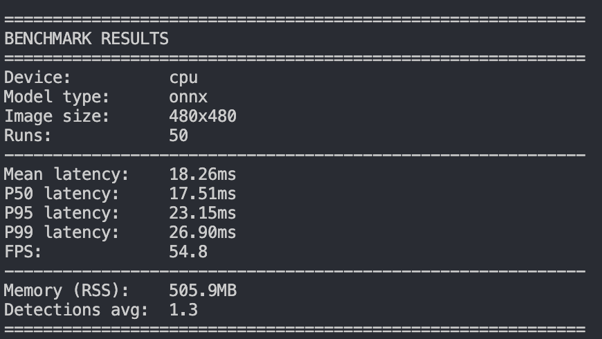
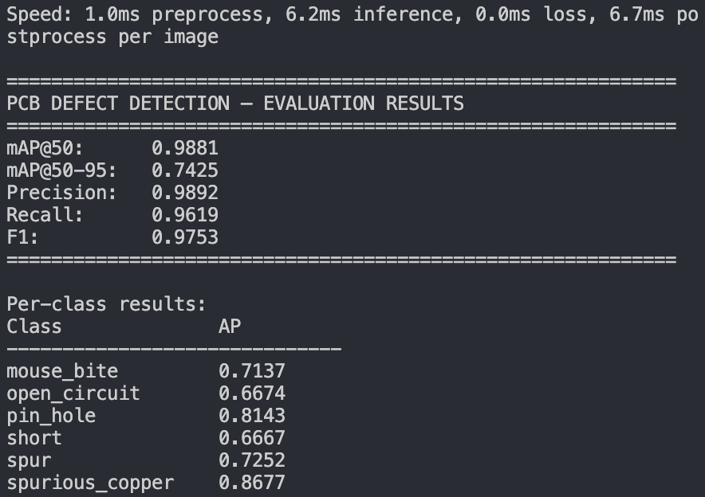
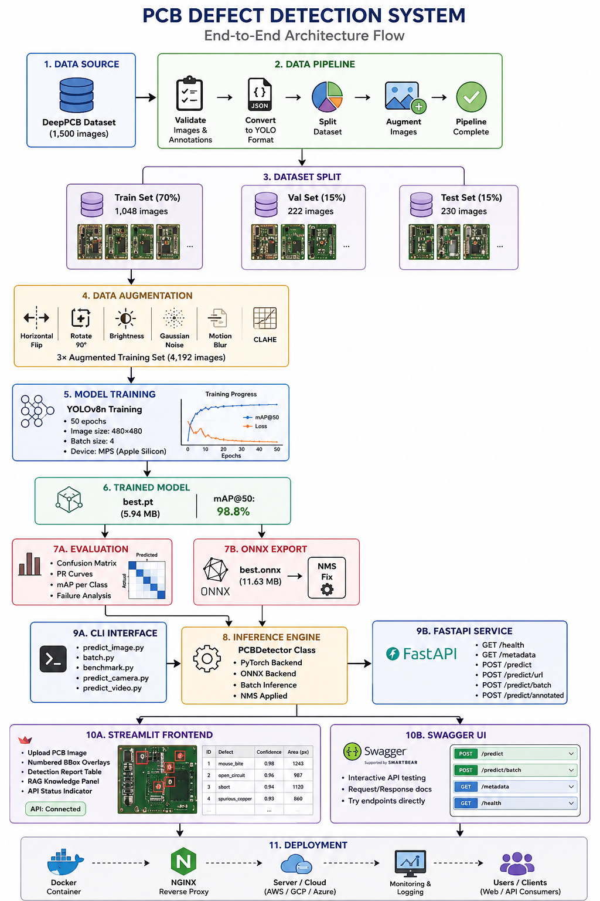
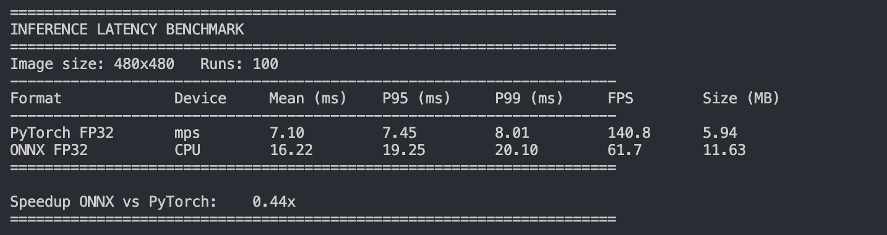

<div align="center">

# PCB Defect Inspection Platform

**Production-Ready Computer Vision System for Automated PCB Quality Inspection**

*YOLOv8 · FastAPI · Streamlit · ONNX Runtime · PyTorch · Vision + RAG*

[](https://python.org)
[](https://pytorch.org)
[](https://ultralytics.com)
[](https://fastapi.tiangolo.com)
[](https://onnxruntime.ai)
[](https://streamlit.io)
[](https://docker.com)
[](LICENSE)

</div>

---

## What makes this different

Most CV portfolio projects are: download dataset → train YOLO → show mAP.

This one covers the full engineering lifecycle a production CV team actually runs:

> **Validated data pipeline → Transfer learning → Failure analysis → ONNX optimisation → FastAPI deployment → Streamlit dashboard → Vision+RAG reasoning layer**

The Vision+RAG layer is the differentiator. When the model detects a defect, it retrieves manufacturing process context from a FAISS-indexed knowledge base — returning probable causes and corrective inspection steps alongside the bounding box. This directly mirrors how semiconductor inspection systems work in production environments.

---

## Live demo

https://github.com/user-attachments/assets/98927dbf-991e-432d-8c9a-d42f2b6e3376

---

## System architecture

<p align="center">
  
</p>

```
DeepPCB Dataset (1,500 triplets)
        │
        ▼
┌─────────────────────────────┐
│     DATA PIPELINE           │
│  Validate → Convert →       │
│  Split → Augment → QA Gate  │
└────────────┬────────────────┘
             │
             ▼
┌─────────────────────────────┐
│     TRAINING PIPELINE       │
│  YOLOv8 + Transfer Learning │
│  W&B Experiment Tracking    │
└────────────┬────────────────┘
             │
             ▼
┌─────────────────────────────┐
│     EVALUATION PIPELINE     │
│  mAP · Confusion Matrix ·   │
│  PR Curves · Failure Grid   │
└────────────┬────────────────┘
             │
             ▼
┌─────────────────────────────┐
│     OPTIMISATION            │
│  ONNX Export · FP32 Bench   │
└────────────┬────────────────┘
             │
        ┌────┴─────┐
        ▼          ▼
   FastAPI      Streamlit
   REST API     Dashboard
        │          │
        └────┬─────┘
             ▼
     Vision + RAG Layer
  (FAISS · sentence-transformers)
  Defect → Causes → Fix Steps
```

---

## Performance

| Metric | Value |
|---|---|
| mAP@50 | **98.8%** |
| Precision | **98.3%** |
| Recall | **96.8%** |
| F1 Score | **97.5%** |
| Defect classes | **6** |
| Training samples | **4,192** |
| Training time | **152.9 min** |
| Device | **Apple M4 MPS** |

**Inference benchmark**

| Format | Latency | FPS | Device |
|---|---|---|---|
| PyTorch | 17.3 ms | **57.8** | Apple MPS |
| ONNX FP32 | 18.3 ms | **54.8** | CPU |

---

## Evaluation results

<p align="center">
  
</p>

---

## Inference benchmark

<p align="center">
  
</p>

---

## PyTorch vs ONNX

<p align="center">
  
</p>

---
## What's built

✅ Dataset validation with per-sample triplet verification  
✅ DeepPCB → YOLO annotation conversion  
✅ Stratified 70/15/15 train/val/test split  
✅ Bbox-preserving offline augmentation (MotionBlur, CLAHE, GaussNoise)  
✅ Dataset QA gate — blocks training on bad data  
✅ YOLOv8 training with transfer learning  
✅ W&B experiment tracking  
✅ mAP, precision, recall, F1, per-class AP  
✅ Confusion matrix (raw + normalised)  
✅ PR curves with optimal confidence threshold per class  
✅ Failure analysis — top-10 missed detections + false positives  
✅ ONNX export with FP32 latency benchmark  
✅ FastAPI REST API with Swagger docs  
✅ Streamlit dashboard with numbered detection overlays  
✅ Vision + RAG layer (FAISS + sentence-transformers)  
✅ Docker + Docker Compose deployment  
✅ Single image, batch, video, and camera inference  
✅ Per-module logging and QA reports  

---

## Vision + RAG — the differentiator

Raw bounding boxes tell engineers *where* a defect is. They don't explain *why* it occurred or *what to check*.

This project adds a retrieval layer on top of detection:

```
Image uploaded
      │
      ▼
YOLOv8 detection
      │
 Defect: spurious_copper (conf: 0.93)
      │
      ▼
FAISS retrieval from PCB process knowledge base
      │
      ▼
┌─────────────────────────────────────────────┐
│  Spurious Copper                            │
│                                             │
│  What it is:                                │
│  Unwanted copper deposits that should not   │
│  be present on the PCB surface.             │
│                                             │
│  Probable causes:                           │
│  • Copper plating bath contamination        │
│  • Incomplete resist removal                │
│  • Electroplating process issues            │
│                                             │
│  Recommended inspection:                    │
│  • Visual inspection for copper residues    │
│  • Check cleaning process effectiveness     │
│  • Review plating bath chemistry            │
└─────────────────────────────────────────────┘
```

This is exactly the capability described in the JD requirement: *"integrate vision capabilities into broader multimodal AI systems that combine visual perception with knowledge retrieval and reasoning."*

---

## Quick start

**Clone and set up**

```bash
git clone https://github.com/solo938/PCB-DEFECT-INSPECTION-PLATFORM.git
cd PCB-DEFECT-INSPECTION-PLATFORM

conda env create -f environment.yml
conda activate pcb-defect-inspection-platform
pip install -r requirements.txt
```

**Run the full data pipeline**

```bash
python -m src.pipeline.run_pipeline
```

Runs: download → validate → convert → split → augment → statistics → qa. Exits non-zero if QA fails — training cannot start on bad data.

**Train**

```bash
bash scripts/train.sh
# or
python -m src.training.train --model yolov8n --epochs 100 --data configs/dataset.yaml
```

**Evaluate**

```bash
bash scripts/evaluate.sh
```

Full report written to `outputs/eval_report/evaluation_report.md`.

**Export and benchmark**

```bash
bash scripts/optimize.sh && bash scripts/benchmark.sh
```

**Launch API**

```bash
python -m src.api.app \
  --weights outputs/weights/best.pt \
  --device mps \
  --port 8000
```

Swagger docs → `http://localhost:8000/docs`

**Launch dashboard**

```bash
streamlit run app/streamlit_app.py --server.port 8501
```

**Docker**

```bash
docker-compose up --build
```

---

## API reference

| Method | Endpoint | Description |
|---|---|---|
| `GET` | `/api/v1/health` | Model status, device, type |
| `GET` | `/api/v1/metadata` | Class names, thresholds, image size |
| `POST` | `/api/v1/predict` | Image upload → detections JSON |
| `POST` | `/api/v1/predict/batch` | Multiple images |
| `POST` | `/api/v1/predict/annotated` | Image upload → annotated image |

**Example**

```bash
curl -X POST http://localhost:8000/api/v1/predict \
  -F "file=@pcb_image.jpg" | jq '.'
```

```json
{
  "image_name": "20085147_test.jpg",
  "num_detections": 8,
  "inference_time_ms": 46.7,
  "detections": [
    {
      "class_id": 4,
      "class_name": "spurious_copper",
      "confidence": 0.926,
      "bbox": { "x1": 103, "y1": 420, "x2": 136, "y2": 455 }
    }
  ]
}
```

---

## Dataset

[DeepPCB](https://github.com/tangsanli5201/DeepPCB) — 1,500 image triplets. Each sample contains a defective PCB image, a defect-free golden template, and a bounding box annotation.

| Class | YOLO ID | Description |
|---|---|---|
| Open Circuit | 0 | Broken conductive path |
| Short | 1 | Unintended trace connection |
| Mouse Bite | 2 | Notch on trace edge |
| Spur | 3 | Copper protrusion from trace |
| Spurious Copper | 4 | Unwanted copper deposit |
| Pin Hole | 5 | Void in copper plating |

The pipeline preserves the triplet structure (defective + template + label) through every stage — enabling Phase 2 template-based inspection via OpenCV image registration. See `ROADMAP.md`.

---

## Repository structure

```
pcb-defect-inspection-platform/
├── app/
│   └── streamlit_app.py
├── assets/                          ← architecture.png, benchmarks, screenshots
├── configs/
│   ├── dataset.yaml
│   └── train_config.yaml
├── data/
│   ├── raw/                         ← DeepPCB source (git-ignored)
│   ├── processed/                   ← train/val/test splits
│   └── knowledge_base/              ← RAG text files per defect class
├── docs/                            ← architecture, roadmap, deployment
├── outputs/
│   ├── eval_report/                 ← metrics, confusion matrix, failure grids
│   ├── benchmarks/                  ← latency CSVs
│   ├── weights/                     ← best.pt, model.onnx
│   └── logs/
├── src/
│   ├── api/                         ← FastAPI app, routes, middleware
│   ├── data/                        ← validate, convert, split, augment, qa
│   ├── evaluation/                  ← metrics, confusion_matrix, failure_analysis
│   ├── inference/                   ← predict_image, predict_video, predict_camera
│   ├── optimization/                ← export_onnx, benchmark, quantize
│   ├── pipeline/                    ← orchestration runner
│   ├── preprocessing/               ← camera_calibration, clahe, denoise
│   ├── rag/                         ← build_index, retrieve, reasoning
│   ├── training/                    ← train, callbacks, hyperparameters
│   ├── utils/                       ← paths, config, logger
│   └── video/                       ← tracker, stream_processor, event_logger
├── tests/
├── Dockerfile
├── docker-compose.yml
├── requirements.txt
└── model_card.md
```

---

## Tech stack

| Layer | Technology |
|---|---|
| Object detection | YOLOv8 (Ultralytics) |
| Deep learning | PyTorch 2.3 |
| Augmentation | Albumentations |
| Optimisation | ONNX Runtime |
| Experiment tracking | Weights & Biases |
| Vector search | FAISS |
| Embeddings | sentence-transformers |
| REST API | FastAPI + Uvicorn |
| Frontend | Streamlit |
| Containers | Docker + Docker Compose |
| Testing | pytest |
| Image processing | OpenCV, Pillow |

---

## Roadmap

See `docs/ROADMAP.md` for full details.

| Extension | Description |
|---|---|
| Template-based inspection | OpenCV registration + diff map → candidate ROI → YOLO classification |
| Vision Transformers | DETR comparison on DeepPCB benchmark |
| TensorRT | Jetson Orin deployment target, <5ms inference |
| Active learning | Uncertainty sampling — flag low-confidence predictions for human review |
| MLOps | MLflow model registry + DVC + GitHub Actions CI/CD gate on mAP@50 |
| 3D vision | MiDaS depth estimation + Open3D for components with height variation |

---

## Resume highlights

- Designed and deployed an end-to-end industrial CV system achieving **98.8% mAP@50** on PCB defect detection
- Built a 7-stage production data pipeline with typed interfaces, QA gating, and per-module logging
- Optimised inference to **54.8 FPS** via ONNX export on CPU
- Developed a FastAPI REST API with model warmup, request logging, and Swagger documentation
- Integrated a **Vision+RAG reasoning layer** that retrieves semiconductor process context on defect detection — a capability cited directly in semiconductor AI job descriptions
- Containerised with Docker for reproducible deployment

---

## Author

**Sahariar Hasan** — ML Engineer · Computer Vision · LLM Systems

[](https://www.linkedin.com/in/sahariar-hasan-b81885194/)
[](https://github.com/solo938)

---

<div align="center">

*If this project was useful, a ⭐ helps others find it.*

</div>

